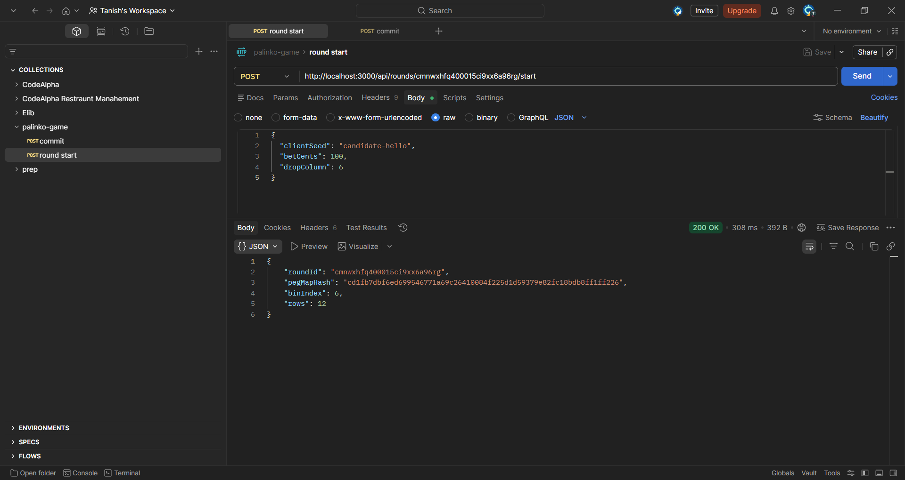
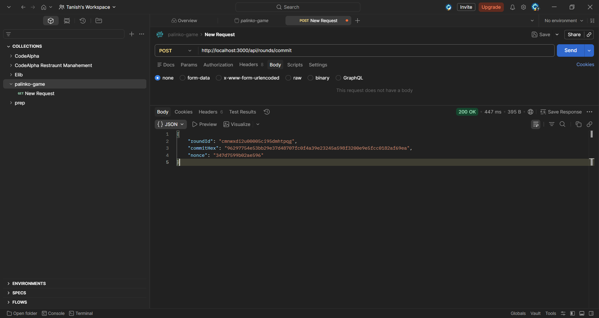
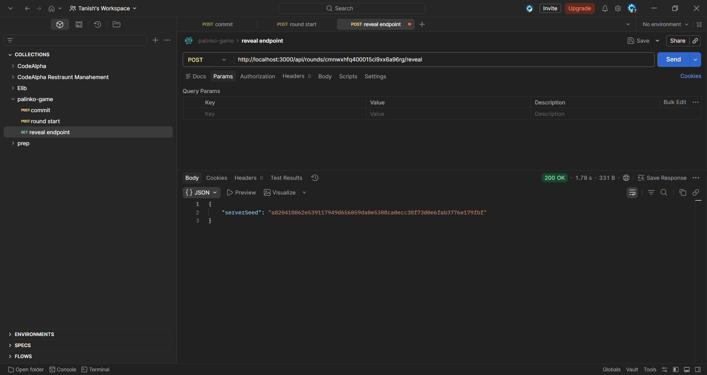
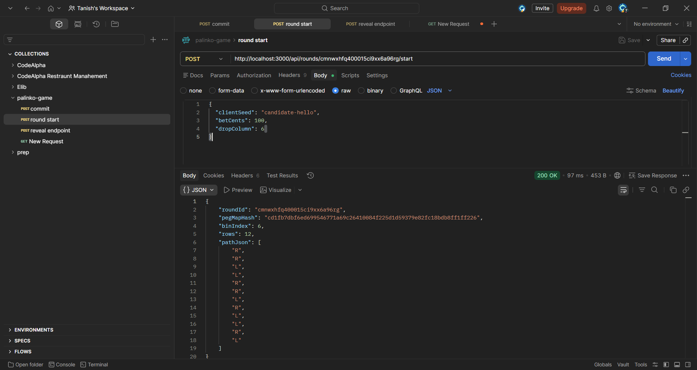

# 🎯 Plinko Lab

A **provably fair Plinko game simulation** built with **Next.js, TypeScript, Prisma, and PostgreSQL**.
The project demonstrates backend fairness verification using cryptographic seeds along with an animated Plinko board UI.

🔗 **Live Demo:**
https://plinko-lab-eight.vercel.app/

---

# 🚀 Technologies & Libraries

## Languages

- TypeScript
- JavaScript

## Frameworks

- Next.js (App Router)
- React

## Backend & Database

- Prisma ORM
- PostgreSQL (Neon Database)

## Tooling

- ESLint
- PostCSS
- npm

## Testing

- Vitest
- Postman (API testing)

---

# 🧠 Project Overview

This project implements a **Plinko game engine with provable fairness**.

Each round follows this process:

1. Server generates a **secret serverSeed**
2. A **commit hash** is stored and returned
3. User provides a **clientSeed**
4. Seeds combine to generate a **deterministic peg path**
5. The ball follows this path visually
6. The round can be **verified after reveal**

This ensures the game outcome cannot be manipulated.

---

# 📸 Screenshots

## UI

### Game Interface


### Round Result Popup


---

## Testing & Development

### Commit Endpoint Test



### Round Start Test



### Reveal Endpoint Test



### Verify Fairness Test



---

## Unit Testing (Vitest)

### PRNG Test File


### Test Execution


---

# 🗂 Repository Structure

plinko-lab
│
├─ app/
│ ├─ page.tsx
│ ├─ verify/
│ └─ api/
│
├─ components/
│ └─ Board.tsx
│
├─ lib/
│ ├─ prisma.ts
│ ├─ prng.ts
│ └─ fairness.ts
│
├─ prisma/
│ ├─ schema.prisma
│ └─ migrations/
│
├─ tests/
│ └─ prng.test.ts
│
└─ snapshots/

---

# ⚙️ Getting Started

Install dependencies:

```bash
npm install

Run development server:

npm run dev

Open:

http://localhost:3000
🧪 Running Tests
npm run test

Tests verify:

deterministic PRNG
fairness logic
peg path generation
🔐 Provable Fairness

Each round uses:

serverSeed + clientSeed + nonce

The server initially publishes:

SHA256(serverSeed)

Later the seed is revealed so players can verify the round outcome.

Verification endpoint:

/api/verify
🌐 Deployment

The project is deployed on Vercel with:

Serverless API routes
Neon PostgreSQL database
Prisma ORM

Live URL:

https://plinko-lab-eight.vercel.app/
📌 Key Features

✔ Provably fair gameplay
✔ Deterministic PRNG path generation
✔ Animated Plinko board
✔ Multi-ball play system
✔ Balance + payout logic
✔ Round verification system
✔ Serverless deployment

📚 Learn More
https://nextjs.org/docs
https://www.prisma.io/docs
https://vercel.com/docs
👨‍💻 Author

Tanish Sharma

Backend-focused developer specializing in Node.js, Express.js, MongoDB, and scalable web systems.

GitHub:
https://github.com/Tanish02
```
